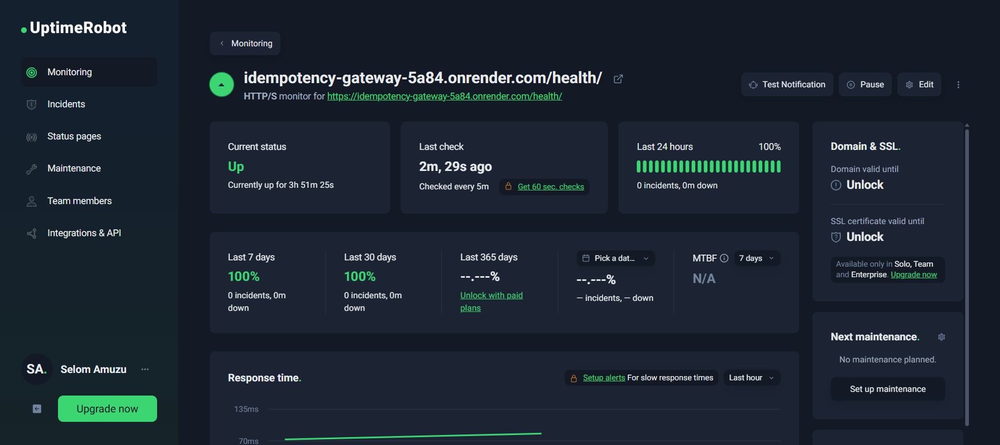
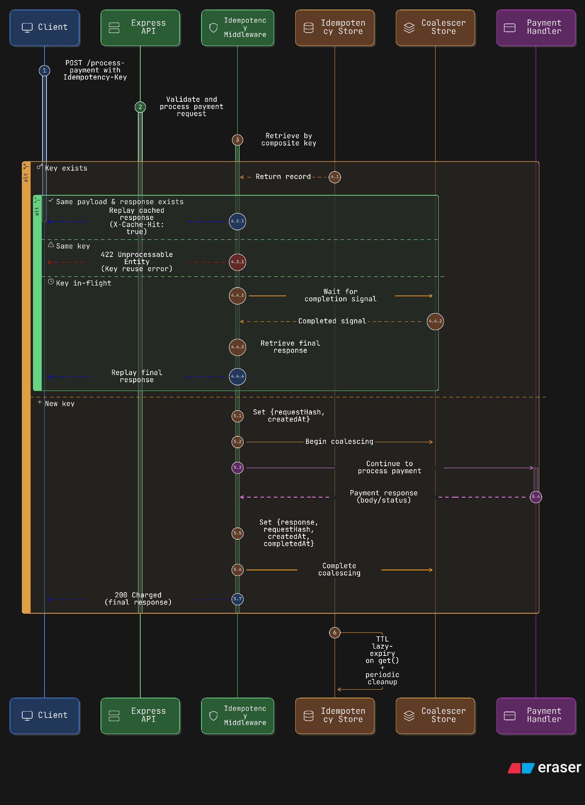

# Idempotency Gateway

An Express + TypeScript service that prevents duplicate payment processing by enforcing idempotency at the API layer.

## Live Status (UptimeRobot)

This service is being monitored on UptimeRobot.



You can also monitor the interactive API docs endpoint directly:

- Live Swagger Docs: `https://idempotency-gateway-5a84.onrender.com/docs`


## 1. Architecture Diagram

[](https://app.eraser.io/workspace/gney7qYS22DAjAQXbmgl?diagram=lRhYxT-joZa1EpxN9IOFd)

## 2. Setup Instructions

### Prerequisites

- Node.js 22+ (Node 24 recommended)
- npm 10+

### Install dependencies

```bash
npm ci
```

### Run in development mode

```bash
npm run dev
```

Server starts on:

- `http://localhost:3000`
- Swagger UI: `http://localhost:3000/docs`
- OpenAPI JSON: `http://localhost:3000/openapi.json`

Live deployment:

- `https://idempotency-gateway-5a84.onrender.com`
- Swagger UI (live): `https://idempotency-gateway-5a84.onrender.com/docs`

### Build for production

```bash
npm run build
```

### Start production build

```bash
npm start
```

### Run tests

```bash
npm test
```

## 3. API Documentation

### Endpoint

- `POST /process-payment`

### Interactive Swagger Docs

This project serves Swagger docs directly from the app:

- `GET /docs` → interactive Swagger UI
- `GET /openapi.json` → raw OpenAPI 3.0 spec

### Required header

- `Idempotency-Key: <uuid>`

### Request body

```json
{
  "amount": 100,
  "currency": "GHS"
}
```

Validation:

- `amount`: number, must be divisible by `0.01`
- `currency`: validated against ISO 4217 using `currency-codes`

### Responses

> Middleware order is: `validateSchema` → `idempotencyMiddleware` → controller.

| Branch | Condition | Status | Response |
|---|---|---:|---|
| Validation failure | Body does not satisfy `RequestSchema` | `400` | `{ "message": "Validation failed", "errors": "..." }` |
| Missing idempotency key | `Idempotency-Key` header is absent | `400` | `{ "error": "Missing idempotency key", "message": "The Idempotency-Key header is required for POST requests" }` |
| Invalid key format | Header exists but is not a valid UUID | `400` | `{ "error": "Invalid idempotency key format", "message": "Key must be 16-64 alphanumeric characters, hyphens, or underscores" }` |
| First valid request (new key) | No existing idempotency record for composite key | `200` | `{ "success": true, "message": "Charged 100 GHS" }` |
| Duplicate replay | Existing record + same payload hash + cached response exists | `200` | Same status/body as first response + `X-Cache-Hit: true` |
| Fraud/error prevention | Existing key reused with different payload hash | `422` | `{ "message": "Idempotency key already used for a different request body." }` |
| In-flight coalesced replay | Existing key is in-flight, wait completes, then response exists | `200` | Same status/body as original response + `X-Cache-Hit: true` |
| In-flight fallback error | Existing key is in-flight, wait completes, but no response found | `500` | `{ "error": "Request could not be replayed", "message": "Original request did not complete successfully" }` |

### Example successful response

```json
{
  "success": true,
  "message": "Charged 100 GHS"
}
```

## 4. Design Decisions

1. **Composite idempotency key**
   - Internal key format is `METHOD:PATH:Idempotency-Key`.
   - This avoids collisions where the same client key might otherwise be reused across different API routes.
   - Including HTTP method protects against semantic differences between operations (for example, `GET` vs `POST`).
   - In payment systems, this reduces accidental replay bleed-over across endpoints and keeps idempotency scope explicit.

2. **Request hash verification**
   - Request body is normalized via `JSON.stringify` and hashed with SHA-256.
   - The hash is bound to the idempotency key at first use.
   - If the same key is later used with a different payload, the request is rejected with `422`.
   - This protects integrity and blocks a common abuse pattern where a stale key is intentionally reused for a different amount/currency.

3. **In-flight coalescing**
   - A dedicated coalescer store tracks active keys and exposes a wait/complete lifecycle.
   - When duplicates arrive during processing, only the first request executes business logic.
   - Concurrent followers wait and then replay the final response instead of executing twice.
   - This design addresses race conditions and prevents duplicate side effects under retry storms.

4. **Response replay fidelity**
   - The middleware stores status code, response body, and headers from the original successful execution.
   - Replay path returns the same payload and status, preserving client-observed behavior.
   - `X-Cache-Hit: true` is added to make replay explicit for observability and debugging.
   - This improves downstream client confidence during retries and simplifies troubleshooting.

5. **Simple in-memory stores**
   - `Map`-based in-memory stores were chosen to keep latency low and implementation simple.
   - This is appropriate for challenge/demo scope and makes logic easy to reason about and test.
   - Tradeoffs:
     - Data is not durable across process restarts.
     - No cross-instance synchronization (horizontal scaling would need shared storage like Redis).
   - Production evolution path: move idempotency and coalescing state to a shared durable backend.

## 5. Developer’s Choice: Idempotency Key Expiration (TTL)

### What was added

Idempotency records now expire automatically using a default TTL of 24 hours:

- **Lazy expiry on access**: expired keys are removed during `get()`.
- **Background cleanup**: periodic sweep removes stale records from memory.

### Why this matters in Fintech

TTL improves operational safety by:

- preventing unbounded memory growth,
- reducing stale-key risk over long time windows,
- aligning idempotency retention with practical retry windows,
- lowering exposure from long-lived cached payment responses.

### Current implementation behavior

- Record timestamps: `createdAt`, `completedAt`
- Expiry condition: `Date.now() - createdAt > ttlMs`
- Cleanup interval is detached with `unref()` so it does not block process exit (important for test/CI stability)
